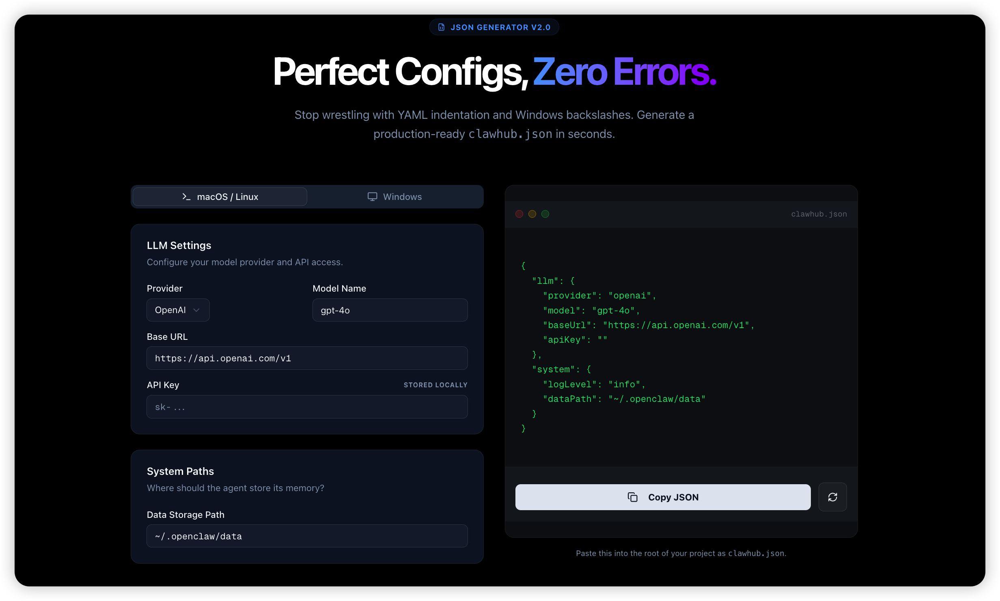

<div align="center">


# ClawKit — Deploy OpenClaw AI Agents in 5 Minutes

**The free, open-source toolkit to configure, debug, and optimize OpenClaw.**

Stop fighting ECONNREFUSED errors, YAML syntax bugs, and Windows path issues.

[](LICENSE)
[](https://nextjs.org)
[](https://getclawkit.com/skills)
[](https://getclawkit.com/status)

[**Live Site**](https://getclawkit.com) &nbsp;|&nbsp; [Config Wizard](https://getclawkit.com/tools/config) &nbsp;|&nbsp; [Local Doctor](https://getclawkit.com/tools/doctor) &nbsp;|&nbsp; [Cost Estimator](https://getclawkit.com/tools/cost) &nbsp;|&nbsp; [Skill Registry](https://getclawkit.com/skills)

</div>

---

## The Problem

Setting up OpenClaw from scratch is painful:

- **Config errors** — One wrong indent in YAML/JSON and nothing works
- **`ECONNREFUSED`** — The #1 error. localhost vs 127.0.0.1, IPv6 binding, port conflicts
- **Windows path hell** — `C:\Users\you` breaks JSON. Every. Single. Time.
- **No idea what it costs** — Running GPT-4.1 24/7 can burn $500+/mo without you knowing
- **7400+ skills, zero discoverability** — How do you find the right plugin?

**ClawKit fixes all of this in your browser. No install. No sign-up. No data leaves your machine.**

---

## Tools

### Config Wizard — Generate Valid OpenClaw JSON in 30 Seconds

> *"I spent 2 hours debugging a missing comma. Never again."*

- One-click presets for **OpenAI, Anthropic, DeepSeek, Google Gemini, Ollama**
- Auto-escapes **Windows backslash paths** (`C:\\Users\\...`)
- Real-time JSON validation with **Zod schema**
- Test API connection directly from the browser
- Copy-paste ready `clawhub.json` output

**[Open Config Wizard →](https://getclawkit.com/tools/config)**



---

### Local Doctor — Fix ECONNREFUSED and Other Setup Issues

> *"npx clawkit-doctor@latest told me my Node.js was too old. Fixed in 2 minutes."*

```bash
npx clawkit-doctor@latest
```

- Checks **Node.js version**, config directory, port availability
- Works on **macOS, Windows (PowerShell), and Linux**
- Zero install — runs via `npx`
- 100% read-only, no data uploaded

**[Run Diagnostics →](https://getclawkit.com/tools/doctor)**

---

### Cost Estimator — How Much Does Your AI Agent Really Cost?

Compare monthly costs across models with exponential context growth simulation:

| Model | ~50 runs/day, 10 steps | Cache 50% |
|-------|----------------------|-----------|
| GPT-4.1 | ~$320/mo | ~$190/mo |
| Claude Sonnet 4.5 | ~$150/mo | ~$95/mo |
| DeepSeek V3.2 | ~$12/mo | ~$8/mo |

*Prices are estimates. Use the [interactive calculator](https://getclawkit.com/tools/cost) for your exact workload.*

**[Open Cost Estimator →](https://getclawkit.com/tools/cost)**

---

### Skill Registry — Browse 7,400+ Verified OpenClaw Plugins

Searchable directory with one-click install commands:

- **Browser Use** — Let your agent control a web browser
- **Memory Core** — Long-term vector memory for agents
- **Crypto Toolkit** — On-chain data, wallet monitoring
- **Discord/Slack Bots** — Multi-platform messaging
- ...and 7,400+ more

Every skill page includes: install command, config snippet, source code link, metadata.

**[Browse Skills →](https://getclawkit.com/skills)**

---

## Common Issues This Toolkit Solves

<details>
<summary><b>Fix: OpenClaw ECONNREFUSED / Connection Refused</b></summary>

The most common OpenClaw error. Usually caused by:
1. Agent not running (`openclaw start` first)
2. Node.js binding to IPv6 — use `127.0.0.1` instead of `localhost`
3. Port 3000 already in use — check with `lsof -i :3000` or `netstat -ano | findstr :3000`

**Quick fix:** Run `npx clawkit-doctor@latest` to auto-diagnose.
</details>

<details>
<summary><b>Fix: JSON Parse Error / Invalid Config File</b></summary>

Common causes:
- Trailing commas in JSON (not allowed!)
- Unescaped Windows paths: `C:\Users` → must be `C:\\Users`
- Copy-paste artifacts from documentation

**Quick fix:** Use the [Config Wizard](https://getclawkit.com/tools/config) to generate a valid config.
</details>

<details>
<summary><b>Fix: Windows Backslash Path Issues in OpenClaw</b></summary>

Windows uses `\` for paths, but JSON treats `\` as escape character.

```json
// WRONG
{ "dataPath": "C:\Users\you\.openclaw\data" }

// CORRECT
{ "dataPath": "C:\\Users\\you\\.openclaw\\data" }
```

**Quick fix:** The Config Wizard auto-detects Windows and escapes paths for you.
</details>

<details>
<summary><b>How to Use DeepSeek with OpenClaw (90% Cost Savings)</b></summary>

DeepSeek V3.2 is fully compatible with the OpenAI API format:

```json
{
  "llm": {
    "provider": "deepseek",
    "model": "deepseek-chat",
    "baseUrl": "https://api.deepseek.com/v1",
    "apiKey": "sk-..."
  }
}
```

Use the [Config Wizard DeepSeek preset](https://getclawkit.com/tools/config) for one-click setup.
</details>

<details>
<summary><b>How to Use Ollama (Local LLM) with OpenClaw</b></summary>

Run your agent 100% offline with Ollama:

```json
{
  "llm": {
    "provider": "ollama",
    "model": "llama3",
    "baseUrl": "http://localhost:11434/v1",
    "apiKey": "ollama"
  }
}
```

No API costs. Full data privacy. Use the [Config Wizard Ollama preset](https://getclawkit.com/tools/config).
</details>

---

## Quick Start (Self-Hosting)

### Prerequisites

- **Node.js** 22+
- **Git**

### Setup

```bash
git clone https://github.com/branzoom/getclawkit-web.git
cd getclawkit-web
npm install
cp .env.example .env   # fill in your keys
npm run dev
```

Open `http://localhost:3000`.

### Environment Variables

```ini
# Required for skill data
DATABASE_URL=your_database_url

# GitHub token for skill crawler
GITHUB_TOKEN=ghp_...

# Optional: LLM for AI-generated skill summaries
LLM_API_KEY=sk-...
LLM_API_URL=https://api.deepseek.com/chat/completions
LLM_MODEL=deepseek-chat
```

---

## Tech Stack

| Layer | Technology |
|-------|-----------|
| Framework | Next.js 15 (App Router, RSC) |
| Styling | Tailwind CSS 4 |
| Components | shadcn/ui, Lucide Icons |
| Validation | Zod |
| Database | Prisma + PostgreSQL |
| Search | Fuse.js (client-side fuzzy search) |
| Analytics | Umami (privacy-first) |
| Deployment | Vercel |

---

## Contributing

We welcome contributions — new tools, bug fixes, skill submissions, docs improvements.

1. Fork this repo
2. Create a feature branch (`git checkout -b feature/my-feature`)
3. Commit your changes
4. Open a Pull Request

**To submit a Skill:** Open a PR adding your repo to the seed list, or [open an issue](https://github.com/branzoom/getclawkit-web/issues).

---

## Related Projects

- [OpenClaw](https://github.com/openclaw) — The AI agent framework this toolkit supports
- [clawkit-doctor](https://www.npmjs.com/package/clawkit-doctor) — CLI diagnostic tool (`npx clawkit-doctor@latest`)

---

## License

MIT — free for personal and commercial use.

---

## Disclaimer

ClawKit is a community-built, unofficial toolkit. Not affiliated with the OpenClaw core team. Verify all generated configurations before production use. We are not responsible for any costs incurred by AI model usage.

---

<div align="center">

**Built by [@branzoom](https://x.com/Xbrave_R)**

[Website](https://getclawkit.com) · [Issues](https://github.com/branzoom/getclawkit-web/issues) · [Twitter](https://x.com/Xbrave_R)

</div>
